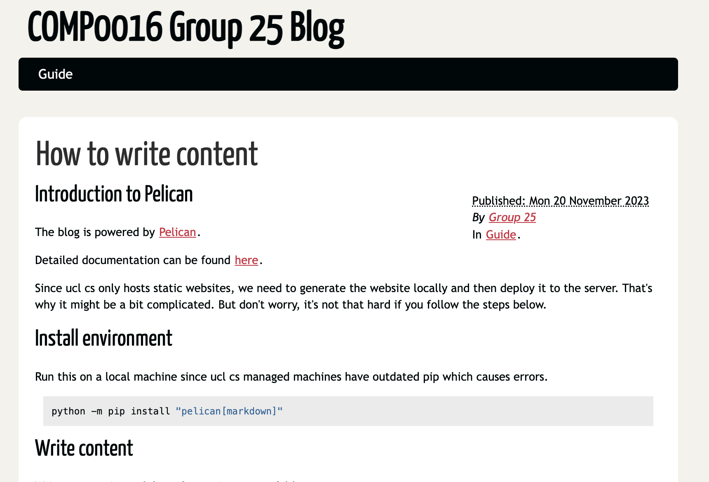
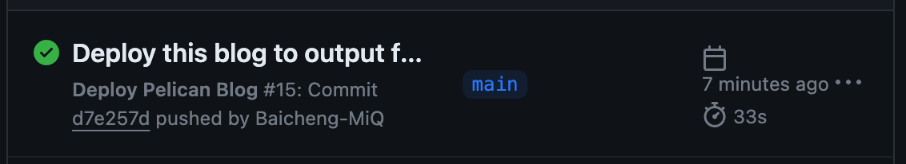

Title: How to write content
Date: 2023-11-20 06:48
Category: Guide

# Visit hosted website [here](http://students.cs.ucl.ac.uk/2023/group25/)



# Introduction to Pelican
The blog is powered by [Pelican](https://blog.getpelican.com/).

Detailed documentation can be found [here](https://docs.getpelican.com/en/latest/index.html).

**Since ucl cs only hosts static websites, we need to generate the website locally and then deploy it to the server. That's why it might be a bit complicated. But don't worry, it's not that hard if you follow the steps below.**

# Automatic deployment by GitHub Actions
## Write content
Write content in markdown format in `content` folder.

Learn more about Markdown [here](https://www.markdownguide.org/basic-syntax/)

Every content must follow this format:
```markdown
Title: My First Blog
Date: 2023-11-03 10:20
Category: Blog

# My First Blog
blablabla
```
## Deploy
I've set up a GitHub Actions workflow to automatically deploy the website to the UCL server.

Simply push to the `main` branch and the website will be automatically deployed to the UCL server.


# Manual deployment
Normally you don't need to do this since the website is automatically deployed by GitHub Actions. However, if you want to deploy the website manually, follow the steps below.


## Install environment
Run this on a local machine since ucl cs managed machines have outdated pip which causes errors.
```bash
python -m pip install "pelican[markdown]"
```

## Write content
Write content in markdown format in `content` folder.

Learn more about Markdown [here](https://www.markdownguide.org/basic-syntax/)

Every content should follow this format:
```markdown
Title: My First Blog
Date: 2023-11-03 10:20
Category: Blog

# My First Blog
blablabla
```

## Generate website
Run this on local machine to generate the website.
```bash
pelican content
```

## Preview website
Run this on local machine to preview the website.
```bash
pelican --listen
```
Then open `http://localhost:8000` in browser.

## Deploy
You need access to a ucl cs managed machine to deploy the website.

A detailed guide can be found [here](https://moodle.ucl.ac.uk/pluginfile.php/6251276/mod_forum/attachment/1748944/Guidelines%20for%20Hosting%20the%20COMP0016%20Project%20Website.pdf).

Make sure you export this project folder to the managed machine (this is detailed in the guide above)

Run this on ucl cs managed machines to deploy the website.
```bash
sh deploy.sh
```
